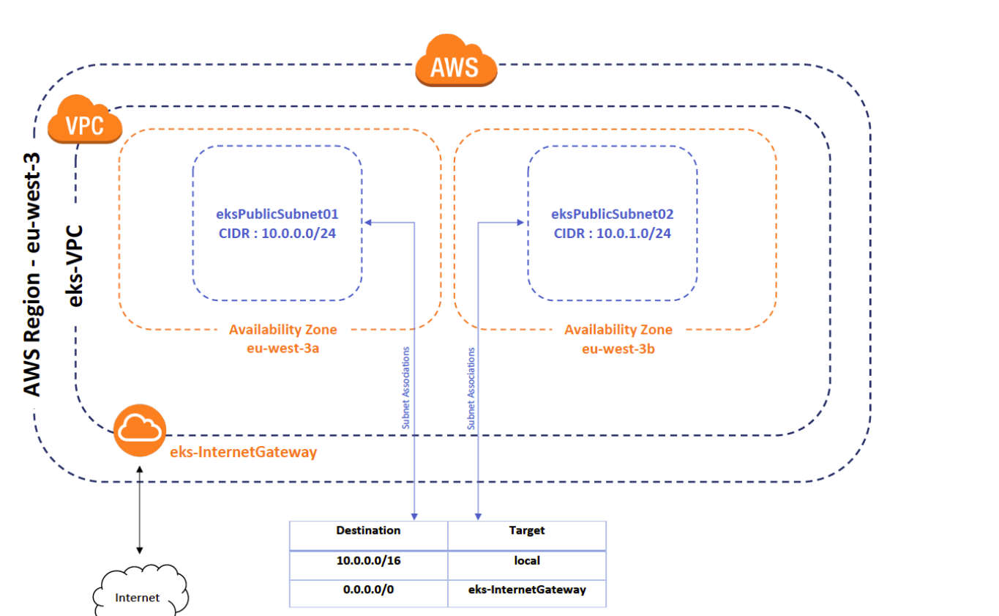
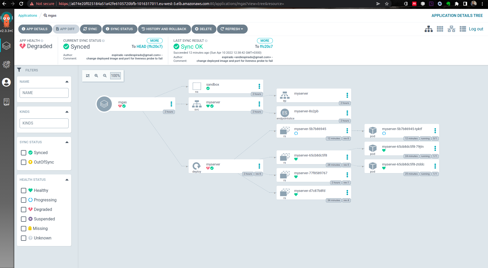
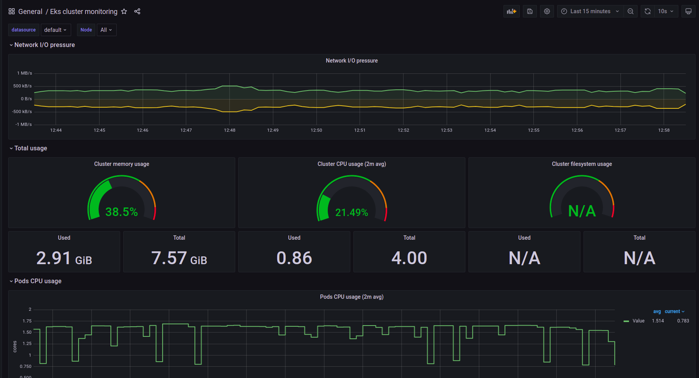
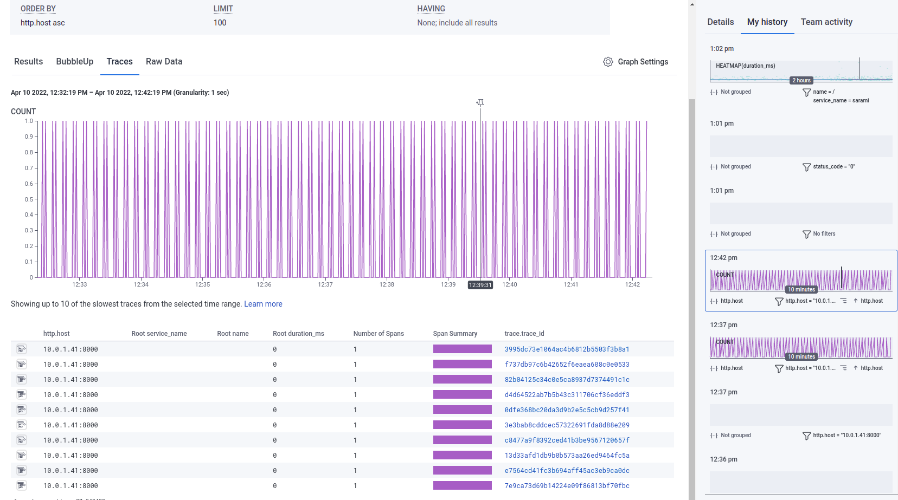

# sample-deploy-to eks using argo cd

# Step 1
 - Create Eks Environment using Cloudformation 
     # Tools
         - AWS cli - To interact with aws API
         - Git - source control management 
         - kubectl - interact with EKs cluster
         - Argo Cd - Continous Deployment
     # Set up 
     
       - Networking 
           - Virtual Private Cloud (VPC), Internet Gateway (IGW), Route Table, Routes, Subnets and Security Groups (SG)

       - AWS EKS Cluster - IAM Cluster (Control Plane) Role, provision EKS  Control Plane, IAM Node Group Role and provision Node Group
            - node group are workers           
       - Argo Cd - a kubernetes controller which continuously monitors running applications and compares the current, live state against the desired target state      

# The application is instrumented with honeycomb for observability and monitoring but we will use prometheus and grafana for infrastucture monitoring inaddition to cloudwatch

# Network setup

# Argo Cd 

# Grafana + prometheus + honeycomb 

